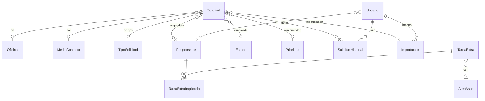

# Arquitectura y modelo de datos

## 1. Arquitectura

```
Navegador (PCs de la mesa)            Servidor interno (PC o VM de ASSE)
┌─────────────────────┐   HTTP(S)   ┌──────────────────────────────────┐
│ Interfaz React       │ ──────────▶ │ ASP.NET Core 10 (HelpDesk.Api)   │
│ tabla, formularios,  │    JSON     │ API REST /api/... + archivos web │
│ dashboard            │ ◀────────── │ login, permisos, historial,      │
└─────────────────────┘             │ importación/exportación de Excel │
                                    └────────────────┬─────────────────┘
                                                     │ Dapper / Microsoft.Data.SqlClient
                                    ┌────────────────▼─────────────────┐
                                    │ SQL Server (base HelpDeskAsse)   │
                                    └──────────────────────────────────┘
```

- **Un solo proceso**: el mismo ejecutable sirve la API y la interfaz web (archivos estáticos en `wwwroot`).
- **API**: Minimal APIs de ASP.NET Core, organizadas por módulo en `src/HelpDesk.Api/Modulos`.
- **Datos**: SQL explícito con Dapper. El esquema está en `database/*.sql` (T-SQL legible por un DBA)
  y se aplica solo al iniciar, con control de versión en `dbo.VersionEsquema`.
- **Excel**: lectura y escritura de `.xlsx` con las librerías de .NET (`System.IO.Compression` y
  `System.Xml`), sin componentes de terceros.
- **Interfaz**: React + TypeScript compilada con esbuild. No carga nada de internet.

### Seguridad

- Login con usuario y contraseña. Contraseñas con PBKDF2-SHA256 (600.000 iteraciones).
- Sesión en cookie `HttpOnly` y `SameSite=Strict`, cifrada por ASP.NET Core Data Protection.
  Se cierra tras 12 horas sin actividad (configurable).
- En cada request se verifica que el usuario siga activo; al cambiar contraseña o rol se invalidan sus sesiones.
- Bloqueo temporal tras 5 intentos fallidos de login.
- Las acciones de escritura exigen un encabezado propio (`X-HelpDesk`), además de la cookie `SameSite`, contra CSRF.
- Encabezados de seguridad (CSP sin orígenes externos, `X-Frame-Options`, `nosniff`).
- Roles: **ADMIN** (configuración, usuarios, importación, reportes, eliminar y corregir fechas) y
  **SOPORTE** (registrar, editar, resolver, buscar, historial, tareas extra).
- Todo cambio queda registrado con usuario y hora (`SolicitudHistorial` y `Auditoria`).

### Edición simultánea

Varias personas trabajan sobre el mismo registro. Al guardar, la interfaz envía solo los campos que
cambió y el valor que tenía en pantalla. Si otra persona modificó **ese mismo campo** mientras tanto,
el servidor no lo pisa: responde con el valor nuevo y quién lo cambió, y el usuario elige si descarta
sus cambios o los guarda igual. Los cambios en campos distintos se combinan sin conflicto.

---

## 2. Modelo de datos



### Tablas

| Tabla | Contenido | Claves y relaciones |
|---|---|---|
| `Solicitud` | Cada fila del registro: fecha de ingreso, día de la semana, funcionario, descripción, observaciones, duración estimada, fecha y minutos de resolución, origen (app o importación), versión, auditoría. | PK `Id` (asignado desde `Secuencia`). FK a `Oficina`, `MedioContacto`, `TipoSolicitud`, `Responsable`, `Estado`, `Prioridad`, `Importacion` y `Usuario` (creó, modificó, eliminó). |
| `SolicitudHistorial` | Un registro por cada cambio: fecha y hora, usuario, acción, campo, valor anterior y nuevo. | FK `SolicitudId`, `UsuarioId`. |
| `Secuencia` | Último número de solicitud emitido. | PK `Nombre`. |
| `Oficina` | Oficinas usadas (se crean al escribirlas por primera vez). | Nombre único. |
| `MedioContacto` | Teléfono, Mail, Redmine, En persona, RocketChat. | Nombre único. |
| `TipoSolicitud` | AD, FFRRHH, Seg, SF, NC, FIEE, EE, Lotus, Error. | Código único. |
| `Estado` | Resuelto, Pendiente HelpDesk, Pendiente Joaco, Pendiente Mica, Pendiente José. `EsResuelto` indica si cierra la solicitud. | Nombre único. |
| `Prioridad` | Alta, Media, Baja, con nivel para ordenar. | Nombre único. |
| `Responsable` | Integrantes de la mesa (Agustín, Facundo, Mauro). | Nombre único. |
| `Usuario` | Cuentas de acceso, rol, responsable vinculado, sello de seguridad. | FK opcional a `Responsable`. |
| `Importacion` | Cada importación de Excel: archivo, hash, quién, cuándo y con qué resultado. | FK `UsuarioId`. |
| `AreaAsse` | Áreas con las que se colabora en tareas extra. | Nombre único. |
| `TareaExtra` | Área, tarea, impacto, carga de trabajo. | FK `AreaAsseId`. |
| `TareaExtraImplicado` | Integrantes implicados en cada tarea extra (muchos a muchos). | PK (`TareaExtraId`, `ResponsableId`). |
| `Auditoria` | Cambios administrativos (catálogos, usuarios, tareas extra, importaciones). | FK `UsuarioId`. |

### Decisiones

- **El nombre del funcionario es texto**, no una tabla aparte: en el registro aparecen "?" y nombres
  sueltos ("Natalia"), así que no hay forma confiable de identificar a la persona. Igual se
  autocompleta y, al elegir a alguien que ya llamó, se completa su última oficina.
- **Las oficinas sí son una tabla**: se escriben siempre igual gracias al autocompletado, las
  estadísticas las agrupan bien y un administrador puede renombrarlas o unificar duplicadas.
- **Nada se borra físicamente**: las solicitudes eliminadas quedan marcadas (`EliminadoEn`) y su número
  no se reutiliza. Los catálogos se desactivan en lugar de borrarse, para no romper el historial.
- **Fechas en hora local de Uruguay** (`DATETIME2(0)`), igual que en el Excel.
- **Numeración propia**: en el Excel el ID es la fórmula `=FILA()-FILA(encabezado)`, así que borrar
  o insertar una fila renumera todo. En la base el número se asigna una sola vez desde `Secuencia`.

---

## 3. Pantallas

| Pantalla | Qué hace |
|---|---|
| Login y cambio de contraseña | Ingreso; la contraseña temporal se cambia obligatoriamente al entrar. |
| Inicio (dashboard) | Solicitudes de hoy, la semana y el mes, pendientes, resueltas, tiempo promedio de resolución; gráficos por mes, tipo, responsable, oficina, medio, prioridad y estado; problemas más frecuentes. Clic en un gráfico abre la tabla filtrada. |
| Solicitudes | Tabla tipo Excel con buscador, filtros rápidos (Todos, Pendientes, Resueltos, Mis solicitudes, Hoy, Sin estado), filtros avanzados, orden por columna, cambio de estado y responsable desde la fila, Resolver, exportar a Excel o CSV. |
| Nueva solicitud | Ventana rápida (tecla N): número y fecha automáticos, autocompletado de funcionario, oficina y descripción, selección de un clic para medio, tipo, responsable, estado y prioridad, y casos anteriores parecidos con su solución. |
| Detalle | Panel lateral con todos los campos editables, resolución y tiempo total, historial y casos parecidos. |
| Pendientes | Solo lo no resuelto, de lo más antiguo a lo más nuevo, con el tiempo que lleva pendiente. |
| Tareas extra | Alta, edición y consulta; exportación. |
| Reportes (admin) | Cantidad o minutos estimados por mes, día, hora, responsable, tipo, oficina, medio, prioridad o estado; con una segunda dimensión en columnas; exportación. |
| Configuración (admin) | Responsables, tipos, medios, estados, prioridades, oficinas (renombrar y unificar), áreas, usuarios e importación de Excel. |

---

## 4. Flujo de una llamada

1. Entra la llamada. El técnico aprieta **N**: el formulario ya muestra el próximo número y la hora.
2. Escribe el nombre del funcionario. Si ya llamó antes aparece con su oficina; al elegirlo se completa la oficina.
3. Elige medio (Teléfono viene marcado) y tipo con un clic, y escribe la descripción. Se autocompleta con
   descripciones usadas antes y a la derecha aparece "Se encontraron N casos similares" con lo que se hizo en cada uno.
4. **Si se resuelve en la llamada:** completa observaciones y duración, deja el estado en Resuelto y guarda
   (Ctrl+Enter). Se registra la fecha de resolución.
5. **Si queda pendiente:** elige Pendiente HelpDesk, Joaco, Mica o José. Queda resaltada en la tabla, suma al
   contador del menú y aparece en *Pendientes*.
6. Más tarde cualquiera la abre, agrega observaciones, cambia el responsable o la resuelve con un clic.
   Cada cambio queda en el historial ("Estado cambiado a Resuelto por Mauro, 13:30") y al resolver se
   calcula el tiempo total desde el ingreso.

---

## 5. Importación del Excel histórico

- Busca la tabla por sus encabezados (no depende de la posición ni del nombre de la hoja) y lee también la
  hoja *Detalle tareas extra*.
- Mantiene los IDs, fechas, responsables, estados y observaciones originales. Detecta duplicados por ID:
  si se importa dos veces, la segunda no agrega nada.
- Muestra un resumen antes de guardar: registros encontrados, nuevos, ya existentes, con error y con advertencias.
- Correcciones automáticas, siempre informadas como advertencia y guardadas en el historial con el valor original:
  - ID vacío: se toma el que corresponde por su posición (igual que la fórmula del Excel).
  - Fechas con errores de tipeo (`1//22/2026`, `3/25/20256`, `910/2026 - 10:44`, `9-46`): se elige la
    interpretación más cercana a las filas vecinas. Sin fecha: se toma la de la fila anterior.
  - Duración con texto ("Tarea no finalizada"): queda vacía.
  - "Ad" se toma como "AD" (los valores se comparan sin distinguir mayúsculas ni tildes).
- Los valores que no existen en los catálogos se agregan (por ejemplo una oficina nueva) y se listan en el resumen.

Con el registro actual (2.366 solicitudes) el resultado es: 2.366 nuevas, 0 con error, 21 con advertencias
(1 ID vacío, 14 fechas y 6 duraciones) y 10 tareas extra.
